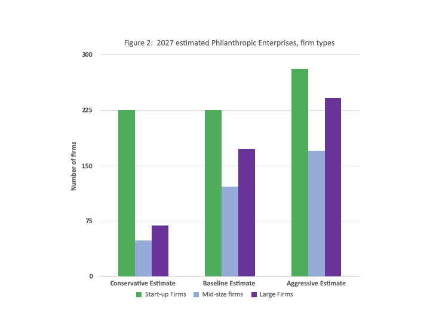

Newman’s Own, a producer of unique salad dressings, popcorn, pizza, salsa, and a host of other food products was founded in 1982 by actor Paul Newman. Because Newman didn’t need the profits, he settled on a unique value proposition: the company would donate 100% of profits to charity. He established the Newman’s Own Foundation to receive those profits and distribute them to charities in selected areas. The company prominently displays “100% of profits to charity” and that relationship is the basis of its brand. To date, Newman’s Own has donated over \$550 Million to charity.

Paul Newman died in 2008 and the ownership of the food company transferred to the foundation. While this would ensure Paul’s legacy of “100% of profits to charity,” it also ran afoul of a 1969 provision in the U. S. Tax Code that prohibited private foundations from owning more than 20% of a company. Newman’s own had until 2013 to make the change, and the IRS granted a five-year extension. In November of 2018, Newman’s Own would have to restructure, and abandon its source of competitive advantage.

The leadership of Newman’s Own decided to try changing the tax law, which took an act of Congress. Our consultants engaged with Newman’s Own Foundation in 2017 to help them deal with long term political risk. As a foundation wholly owned by a corporation, Newman’s Own ran afoul of US tax laws. Most Representatives and Senators were sympathetic to the cause, but they wanted to make sure that changing the tax code would help more businesses than Newman’s Own. They needed hard data and insightful analysis to help them convince Congress that this was a strategic opportunity and not a threat.

Paul Godfrey provided the foundation with a quantitative model that helped Representatives and Senators understand the potential strategic upside for Newman’s Own, the philanthropic sector of the economy, and US society in general. We found that a change in the law would encourage other companies to become “philanthropic enterprises” like Newman’s Own, and the economic impact would be substantial as time went on. Our analysis provided the foundation’s leaders with more ammunition to convince a wavering and congress reluctant to pass any legislation to capitalize on this strategic opportunity.

Newman’s Own used this consulting product, plus a number of other reports we produced for them, to continue to press for a Congressional vote. The case for changing the law was clear to all; however, getting Congress to pass any law was a challenge. The bill that contained the change found itself included in the Bipartisan Budget Act of 2018 and become law on 09 February of that year. Newman’s Own was ready to engage specialized lawyers to begin to restructure the company. The law passed—literally—in the nick of time.

Political risk quite often becomes strategic risk—changes in public policies, regulatory approaches, and the orientation of political leaders towards business creates a classic case of strategic risk: a new and uncertain environment that can either bolster or bust-up a company’s competitive advantage. Political risks are difficult to manage and having a strong partner that produces robust and rigorously derived forecasts can help a company navigate the challenges waters of the political system. In the Newman’s Own case, it was about much more than just eliminating a strategic threat, it was about capitalizing on a huge opportunity to improve civil society in the United States.
