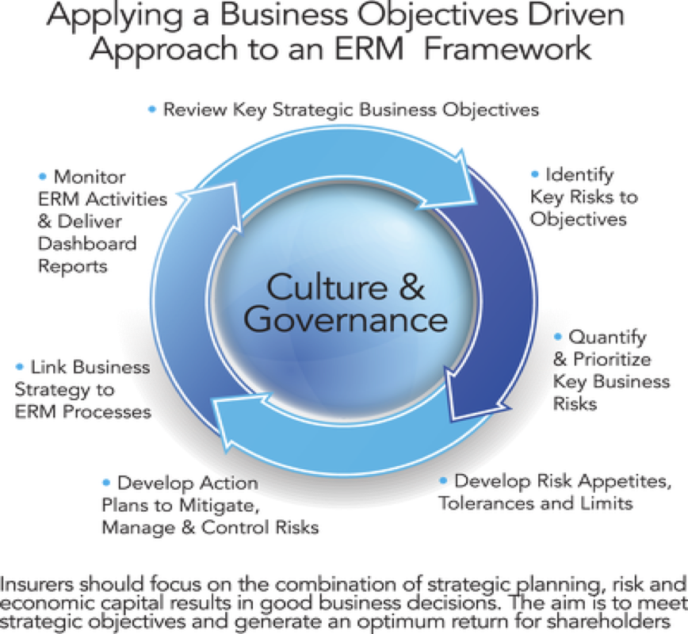

Questar, now Dominion Energy, is a large utility in the Western United States, with an expansive production and distribution network for Natural Gas. Managing risk in a highly regulated environment is always a challenge, and a wise Chief Risk Officers realized that an outside consultant would be pivotal in implementing a new Enterprise Risk Management program. We helped design and then taught a 14 week course on Enterprise Risk Management. The Enterprise Risk Management course was based on The Institutes ARM-57 course that covered the following topics:

1. The Advantages of Enterprise Risk Management- Improving strategic decision making with ERM, Traditional Risk Management vs. ERM, ERM in approaching business uncertainty, ERM frameworks and standards.

1. Establish Internal and External Contexts: Risk Culture and Attitude, Goals, and Sustainable Development –The influence of organizational culture on risk attitude, align individual objectives and organizational strategic goals, risk attitude and department objectives, and sustainable development.

1. Establish Internal and External Context: ERM and Strategic Planning- Strategic development process and types of business strategies, developing ERM goals aligned with strategic goals, using a risk maturity model, analyzing an organization’s internal and external contexts, and conducting a SWOT analysis.

1. Establish Internal and External Context: Incorporating Business and Economic Intelligence-Economic Intelligence-ERM program application, elements of business intelligence system, business intelligence systems-Enterprise-wide risk management implementation steps, business intelligence systems-IT governance and outputs, business intelligence-presenting the case for ERM.

1. Risk Assessment: Exposure Analysis-Exposure spaces and risk assessment, impact-role of exposure analysis and evaluation, applying the exposure spaces model.

1. Risk Assessment: Management Departments, Risk Centers, and Uncertainty Modeling- Management departments, risk centers and risk owners, methods and limitations of uncertainty modeling, risk quantification case study.

1. Risk Treatment: Reacting to Disruptions- Levels of disruption, managing risk to reputation, activities to prepare executives and managers to face disruptions, mitigating risk thorough business continuity planning.

1. Risk Treatment: The Supply Chain and Crisis Communication- Supply chain risk management, crisis communication, and recommending risk appropriate mitigation tools.

1. Risk Treatment: Risk Financing- Evaluating an investment proposal, limitations of cash flow analysis in decision making, importance of risk return relationship, portfolio selection and optimizing risk taking, and cost of capital and optimal capital allocation.

1. Risk Treatment: Alternative Risk Transfer and Derivatives- Purpose and functions of derivatives and alternative risk transfer in risk financing.

1. Monitor and Review: The Role of Governance and Compliance in ERM- Integrating governance and compliance with ERM, governance and ERM, Compliance issues in ERM, Ethics and social responsibility in ERM.

1. Monitor and Review: Assurance in ERM- Review and monitoring for continuous improvement, assurance and risk management, ERM to meet financial rating agencies.

1. Communicate and Consult: Risk Ownership and Communication with Stakeholders- The importance of risk ownership by internal stakeholders, communication with stakeholders, the importance of risk ownership by external stakeholders, developing an ERM business case, and determining and organization’s risk criteria.

1. Communicate and Consult: Project Management- Project management with plan development and implementation, managing risks in a project, organizational change management steps, and implementing ERM-continuous change.

